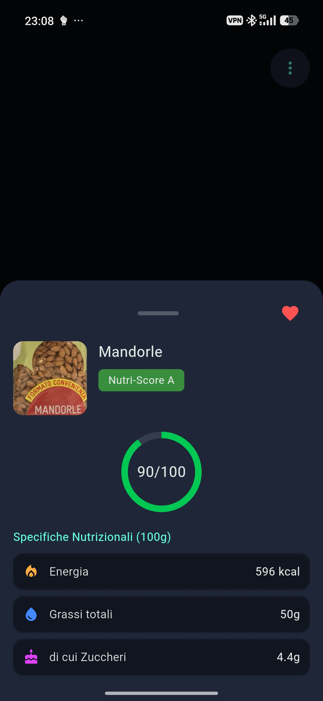

# Yumi 🍅🌱

Yumi is an independent, open-source mobile application dedicated to consumer protection and nutritional analysis of food products. 

Designed as a privacy-respecting alternative to services like Yuka, Yumi allows you to instantly understand the health impact of what you eat without compromising your personal data.

<p align="center">
  
</p>

## ✨ Key Features

- **100% Privacy-First:** No account required, no tracking, and no data sent to third-party servers for profiling.
- **Fast Scanning:** Instant recognition of barcodes (EAN-13, EAN-8, UPC, etc.) via camera or manual input.
- **Adaptive Interface:** Full support for system auto-theme, dark theme, AMOLED mode for energy saving, and a refined, high-contrast **Dark Teal Light Theme**.
- **History & Favorites:** Save your favorite products or browse your latest scans directly, stored locally on your device.
- **Multilingual:** Native support for Italian and English.

## 🧮 How the Algorithm Works (Health Score)

Yumi calculates a health score out of one hundred (`0-100`) based on a strict mathematical model that processes Open Food Facts data. The calculation follows these exact steps:

### 1. Base Score Definition (Nutri-Score)
The application extracts the official Nutri-Score grade (`A`, `B`, `C`, `D`, `E`) and its corresponding numerical base score (`from -15 to +40`).

* **If the product is Water:** It automatically receives a starting score of **100 points** and does not suffer organic penalties.
* **If Nutri-Score numerical data is available:**
  * **Solid Foods:** The score is scaled proportionally to the official -15 to +40 range. The applied formula is:  
    `Base Score = 100 - (((NutriScore_Score + 15) / 55) * 100)`
  * **Beverages:** The score is scaled proportionally to the specific liquids range from -20 to +40. The applied formula is:  
    `Base Score = 100 - (((NutriScore_Score + 20) / 60) * 100)`
* **If only the Letter is available (Estimated Grade):**  
  In the absence of a precise numerical score, a standard value is assigned based on the letter:  
  `A = 100` | `B = 85` | `C = 65` | `D = 45` | `E = 25`.

### 2. Penalties for Harmful Additives
The algorithm analyzes the present food additive tags (`E-number`) and applies a penalty based on the scientific risk level (only the penalty of the most severe category found is applied):

* **High Risk (Penalty: -15 points):** Nitrites and nitrates (`E249, E250, E251, E252`), sulfites (`E220-E228`), azo and harmful dyes (`E102, E104, E110, E122, E124, E129, E131, E133, E150c, E150d, E151`), intense artificial sweeteners (`E950, E951, E952, E954, E955, E961, E962`).
* **Moderate Risk (Penalty: -8 points):** Phosphates (`E338, E339, E340, E341, E343, E450, E451, E452`), glutamates (`E620-E625`), flavor enhancers (`E627, E631, E635`), and critical emulsifiers/thickeners (`E432-E436, E466, E471, E472e, E473, E475, E476, E491, E492`).
* **Limited Risk (Penalty: -4 points):** Secondary thickeners and gelling agents (`E407, E412, E414, E415, E416, E417, E425, E461`), polyols/bulk sweeteners (`E420, E421, E953, E965, E966, E967, E968`).

### 3. Penalty for Lack of Organic Certification
Organic farming reduces exposure to chemical pesticides. If the product (excluding water) **does not possess** tags or labels certifying its organic nature (`organic`), it suffers a fixed penalty of **-5 points**.

### 4. Final Calculation and Safety Ceilings
The final score is calculated by subtracting the penalties from the base score:  
`Final Score = Base Score - Additives Penalty - Organic Penalty`

To prevent low-quality products from receiving high scores simply due to the absence of additives, the algorithm applies **unpassable maximum caps** determined by the real Nutri-Score grade:
* If the Nutri-Score is **E**: the score cannot exceed **29/100**
* If the Nutri-Score is **D**: the score cannot exceed **49/100**
* If the Nutri-Score is **C**: the score cannot exceed **69/100**

The result is then rounded to the nearest integer and strictly capped within the `0-100` range.

## 📸 Screenshots

<p align="center">
  
</p>

## 🚀 Getting Started (Development)

The application is built using **Flutter (Material 3)** and is compatible with both Android and iOS.

### Prerequisites
- Flutter SDK (version 3.22 or higher)
- Android Studio / Xcode

### Installation
1. Clone the repository:
   ```bash
   git clone [https://github.com/your-username/yumi.git](https://github.com/your-username/yumi.git)


2. Navigate to the project directory:
```bash
cd yumi

```


3. Install dependencies:
```bash
flutter pub get

```


4. Run the application:
```bash
flutter run

```


## 🛠️ Built With

* **Framework:** [Flutter](https://flutter.dev)
* **Scanning:** [mobile_scanner](https://pub.dev/packages/mobile_scanner) (powered by Google ML Kit)
* **Product Database:** Public APIs from [Open Food Facts](https://world.openfoodfacts.org/)
* **Data Persistence:** `shared_preferences` for local storage of history and settings.

## 📜 Required Acknowledgments and Licenses

Yumi is a transparent project built on the work of great open-source communities:

* **Open Food Facts:** Product data is sourced from the free and collaborative Open Food Facts database, distributed under the *Open Database License (ODbL)*, and media assets under *CC-BY-SA*.
* **Flutter SDK & Cupertino:** Distributed under the *BSD 3-Clause License*.
* **mobile_scanner:** Distributed under the *MIT License*.
* **shared_preferences:** Distributed under the *BSD 3-Clause License*.
* **Google ML Kit Barcode Scanning:** Subject to the *Google APIs Terms of Service*.

---

*Yumi is an independent application and is not affiliated in any way with Yuka or Open Food Facts.*
